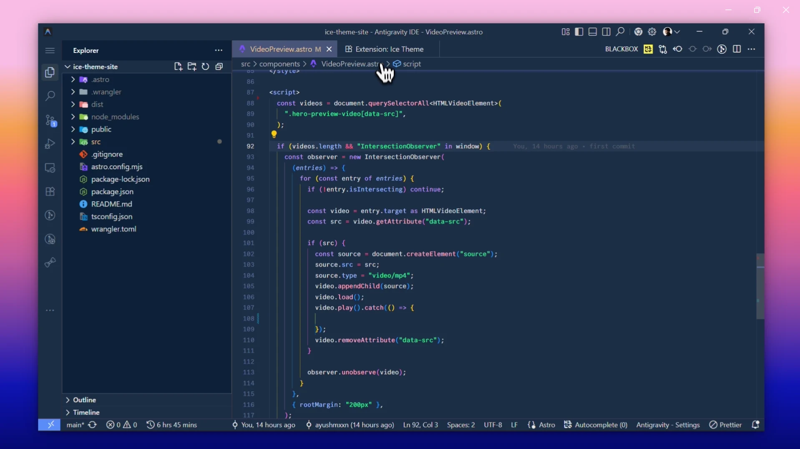

## Ice Theme | A Calm Dark Theme for Code Editors 🧊

## Installation

**1.** Open the **Extensions** view (`Ctrl` + `Shift` + `X`). 
**2.** Search for **Ice Theme**. 
**3.** Click **Install**. 
**4.** Open **Preferences → Color Theme** (`Ctrl` + `K`, `Ctrl` + `T`). 
**5.** Select **Ice** or **Blaze**.

## Feedback

Enjoying it? I'd really appreciate a ⭐ rating and review on the [Visual Studio Code Marketplace](https://marketplace.visualstudio.com/items?itemName=AyushmaanSingh.blazetheme&ssr=false#review-details).

## License

This project is licensed under the [MIT License](LICENSE).
