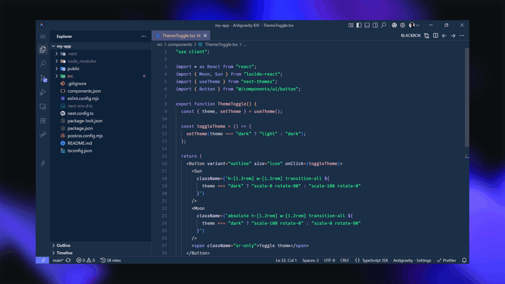

# Ice Theme

A clean and modern theme pack for Visual Studio Code.

## Installation

1. Open the **Extensions** view (`Ctrl` + `Shift` + `X`).
2. Search for **Ice Theme**.
3. Click **Install**.
4. Open **Preferences → Color Theme** (`Ctrl` + `K`, `Ctrl` + `T`).
5. Select **Ice** or **Blaze**.

## Feedback

Enjoying it? I'd really appreciate a ⭐ rating and review on the [Visual Studio Code Marketplace](https://marketplace.visualstudio.com/items?itemName=AyushmaanSingh.blazetheme&ssr=false#review-details).

## License

This project is licensed under the [MIT License](LICENSE).
